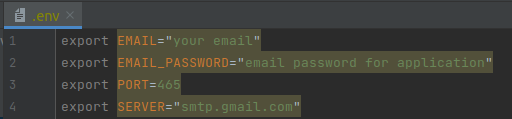
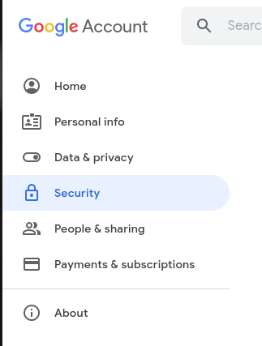
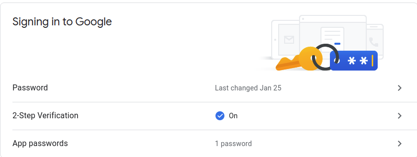
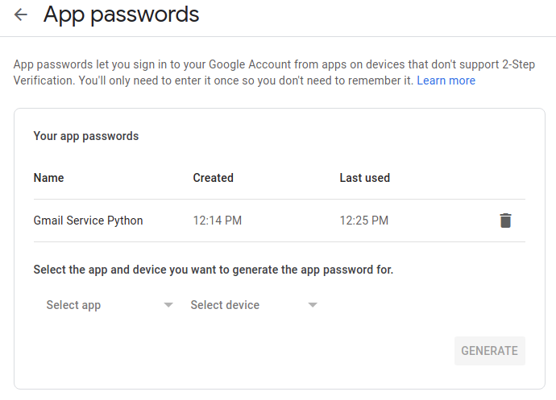
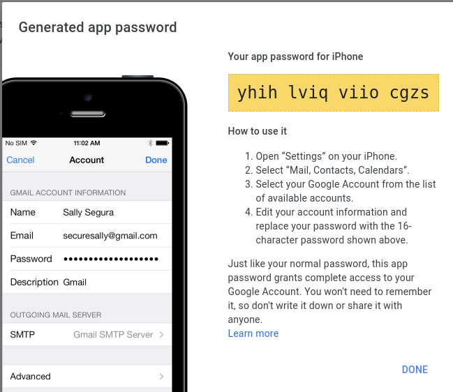

# GmailService

# To run code you should create .env file

# How to create and use app passwords
1. Open the [Google Account page](https://myaccount.google.com/personal-info)
2. Click **Security**.

3. Under 'Google Sign In', select **App passwords** . Sign in if necessary. This option is not available if:
   - 2-step verification is not set up for your account;
   - two-step authentication is configured only for electronic keys;
   - you're signed in to a work, school, or other corporate account;
   - Your account has Advanced Protection enabled.

   
4. At the bottom of the page, click **Application** and select the option you > want click Device and select the model > Create .

   
5. Following the instructions, enter the application password (16-character code on the yellow line).
   
6. Click **Done** ..

After paste password to .env file and activate environment variables with source .env
And run main.py python file